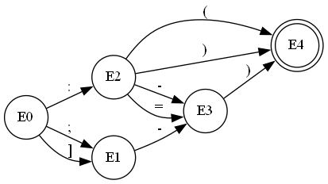
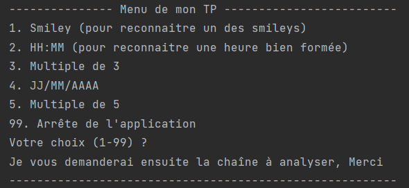
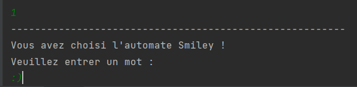
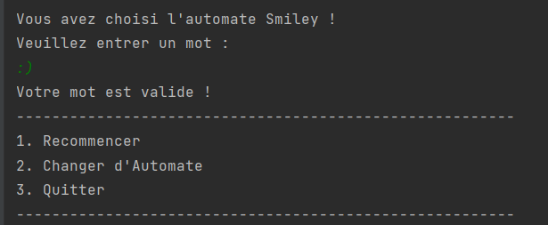

## Compte rendu Automates et Langages
 *Sylvain Baudouin - IUT Nantes - BUT2 Informatique - Groupe 2-1*
 
L'objectif de ce compte rendu est de résumer mon travail à l'issue 
des séances de programmation d'un analyseur paramétré par un automate.
Le projet à été réalisé en février 2023 pour le cours Automates et
Langages de l'Université de Nantes par Mr Attiogbé.
### *_Introduction_*

Lors de ce cours nous avons étudié les automates et les langages.
Nous avons vu comment les automates peuvent être utilisés pour
décrire des langages et comment les langages peuvent être utilisés
pour décrire des automates.\
Un automate est un modèle mathématique qui permet de décrire 
le comportement d'un système en utilisant des états et des transitions 
entre ces états. Les automates sont utilisés dans de nombreux domaines, 
notamment en informatique, en électronique, en linguistique, etc. 
Dans le cadre de ce projet, nous avons travaillé sur l'analyseur/accepteur d'automates.


### *_Analyseur d'automates_*

Pour mon analyseur d'automate j'ai choisi de diviser mon travail en 3 parties.
Qui peuvent se résumer en 3 classes : Automate, Etat et Application.\
Dans la classe *_Automate_* j'ai défini les différents attributs de mon automate. \
On y retrouve : 
1. Le nom de l'automate noté _nom_
2. La liste des états noté _S_  
3. L'alphabet, une liste de caractères noté _alphabet_
4. Les états finaux, une liste de _State_  noté _finialStates_
5. L'état initial, un _State_ noté _initState_

La classe prend en paramètre un nom pour le construire.\
J'ai également défini les méthodes setter des attributs de l'automate.\
Enfin, j'ai défini la méthode _isValid(text : String)_ qui permet de vérifier si un mot est accepté par l'automate.


Dans la classe *_Etat_* j'ai défini les différents attributs d'un état.\
On y retrouve :
1. Le nom de l'état noté _nom_
2. La liste des transition de l'état sous forme d'une HashMap noté _outGoing_

La classe prend en paramètre un nom pour le construire.\
En plus de la méthode getter du nom j'ai défini deux autres méthodes :
1. _addOutGoing(key: String, state: State)_ qui permet d'ajouter une transition à l'état
2. _getByKey(key: String): State?_ qui permet de récupérer l'état d'arrivée d'une transition à partir d'un caractère passé en paramètre

Dans la classe de l'Application on va y retrouver différentes methodes pour la gestion de l'automate.\
On y retrouve :
1. _start()_ qui permet de lancer l'application
2. _play(automate: Automate)_ qui permet de lancer l'analyse d'un mot par l'automate passé en paramètre
3. _loadFromJson(path : String)_ qui permet de charger un automate à partir d'un fichier json

J'ai encodé 5 automates différents qui se trouve dans le dossier _data_.\
Ces automates sont :
1. L'automate qui reconnait les smileys
2. L'automate qui reconnait les heures sous la forme HH:MM
3. L'automate qui reconnait les nombres multiples de 3
4. L'automate qui reconnait les dates sous la forme JJ/MM/AAAA
5. L'automate qui reconnait les nombres multiples de 5 

J'ai choisi d'utiliser le format json pour stocker mes automates.\
Il m'a permis de rendre mon stockage plus lisible et plus facile à manipuler.\
Voici un exemple de la structe simple que j'ai décider de mette en place :

```json
{
  "name" : "Smiley",
  "alphabet" : [":",";","(",")","]","-","="],
  "S" : ["E0","E1","E2","E3","E4"],
  "init" : "E0",
  "final" : ["E4"],
  "transition" : [
    {"E0" : [":","E2"]},
    {"E0" : [";","E1"]},
    {"E0" : ["]","E1"]},
    {"E1" : ["-","E3"]},
    {"E2" : ["(","E4"]},
    {"E2" : [")","E4"]},
    {"E2" : ["-","E3"]},
    {"E2" : ["=","E3"]},
    {"E3" : [")","E4"]}
  ]
}
```
_Cet exemple représente l'automate qui reconnait les smileys._

Dans ce fichier on va y retrouver toutes les données qui permettent de définir un automate ainsi que les transitions entre les états.

Cet automate de smiley peut se résumé dans le graphe suivant :\
\
_Représentation de l'automate de smiley sous forme d'un graphe_
### *_Utilisation de l'application_*

Pour utiliser l'application il suffit de lancer le Main.kt qui se trouve dans le dossier _src_.\
L'application va alors afficher un menu qui va permettre de choisir l'automate à utiliser.\
\
_Menu de l'application_\
Après avoir choisi l'automate en entrant le chiffre correspondant à l'analyse souhaité on va pouvoir entrer un mot à analyser.\
\
_Analyse d'un mot par l'automate_\
L'application va alors afficher le résultat de l'analyse.\
\
_Résultat de l'analyse_\
Puis, en entrant de nouveau un chiffre on va pouvoir choisir de recommencer l'analyser d'un mot avec l'automate choisi précédemment ou de choisir un autre automate ou encore quitter l'application.

### *_Conclusion_*

Pour conclure ce projet me permet maintenant de posséder un outil qui me permet de tester des automates et donc d'analyser rapidement des nombres ou encore des dates.
Et il m'a également permis d'améliorer ma compréhension des automates.
